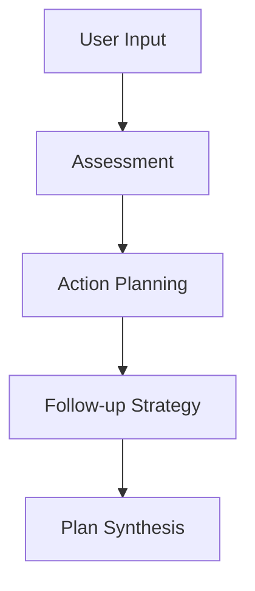
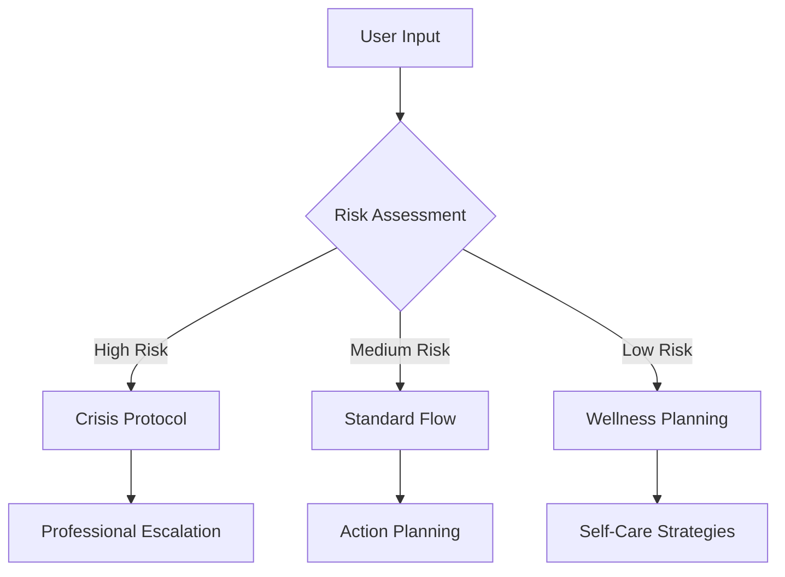

# AG2/AutoGen → LangGraph Migration Analysis Report

**Generated**: 2025-01-14  
**System**: AI Mental Wellbeing Agent Team  
**Analyst**: Claude Code SuperClaude  

## Executive Summary

Current system implements **sequential coordination pattern** (not true AG2/AutoGen), simplifying LangGraph migration. Critical healthcare safety protocols require enhancement during transition.

**Key Finding**: Migration complexity is LOWER than expected due to lack of true conversational agent features.

---

## 1. Current Architecture Analysis

### Agent Structure
```
🧠 AgentCoordinator (Orchestrator)
├── 📊 AssessmentAgent (Mental Health Screening)
├── ⚡ ActionAgent (Crisis Intervention)  
└── 🔄 FollowUpAgent (Recovery Planning)
```

### Agent Responsibilities Matrix
| Agent | Clinical Assessment | Crisis Response | Resource Matching | Long-term Planning |
|-------|-------------------|-----------------|-------------------|-------------------|
| Assessment | ✅ Primary | ⚠️ Detection Only | ❌ | ❌ |
| Action | ❌ | ✅ Primary | ✅ Primary | ❌ |
| FollowUp | ❌ | ❌ | ⚠️ Limited | ✅ Primary |

---

## 2. Communication Patterns

### Current: Linear Pipeline


### Target: LangGraph State Management


**Migration Impact**: Complete architectural transformation required

---

## 3. Dependencies & Integration Points

### Core Stack
- **Runtime**: Node.js 18+ with TypeScript 5.3.2
- **AI Provider**: OpenAI API (GPT-4o) - **Single point of failure**
- **Interface**: Telegram Bot API (Spanish)
- **Validation**: Zod schemas
- **Logging**: Winston

### Critical Dependencies
| Component | Current | Migration Risk | Mitigation |
|-----------|---------|----------------|------------|
| OpenAI API | Hard dependency | 🔴 High | Multi-provider support |
| Telegram Bot | Interface layer | 🟡 Medium | Interface abstraction |
| Type Validation | Zod schemas | ✅ Low | Direct port |
| Logging | Winston | ✅ Low | Compatible |

---

## 4. Healthcare Safety Analysis

### Current Safety Protocols
- **Crisis Detection**: Basic keyword scanning
- **Risk Assessment**: Rule-based scoring  
- **Resource Escalation**: Hardcoded crisis resources
- **Data Retention**: No explicit policy (⚠️ Compliance risk)

### Critical Safety Gaps
1. **No Clinical Validation**: AI responses lack professional review
2. **Limited Crisis Protocols**: Keyword detection insufficient
3. **Data Privacy**: No HIPAA compliance framework
4. **Audit Trail**: Insufficient clinical accountability logging

### Required Enhancements for LangGraph
```python
# Enhanced Safety Layer
class ClinicalSafetyValidator:
    def validate_response(self, response: dict, risk_level: str) -> bool:
        # Clinical guideline validation
        # Crisis indicator detection
        # Professional escalation protocols
        # Audit trail generation
        pass
```

---

## 5. Migration Strategy: 10-Week Incremental Approach

### Phase 1: Foundation (Weeks 1-2)
**Goal**: Parallel development infrastructure

```bash
src/
├── legacy/          # Current TypeScript system
├── langgraph/       # New Python implementation
└── migration/       # Transition utilities
```

**Deliverables**:
- LangGraph POC setup
- Basic state graph definition
- Development environment configuration

### Phase 2: Agent Migration (Weeks 3-4)
**Goal**: Port individual agents to LangGraph nodes

**Key Changes**:
- Sequential agents → Graph nodes
- Context passing → Shared state
- Type interfaces → Python TypedDict

### Phase 3: Advanced Features (Weeks 5-6)
**Goal**: LangGraph-specific enhancements

**New Capabilities**:
- Dynamic routing based on risk assessment
- RAG integration for evidence-based responses
- Complex workflow orchestration

### Phase 4: Safety & Compliance (Weeks 7-8)
**Goal**: Healthcare-grade safety protocols

**Critical Implementations**:
- Clinical validation layer
- HIPAA compliance framework
- Professional escalation protocols
- Audit trail system

### Phase 5: Deployment (Weeks 9-10)
**Goal**: Production migration with monitoring

**Deployment Strategy**:
- A/B testing (10% traffic initially)
- Blue-green deployment
- Real-time quality monitoring
- Gradual rollout based on metrics

---

## 6. Risk Assessment & Mitigation

### High-Risk Migration Points
| Risk | Impact | Probability | Mitigation Strategy |
|------|--------|-------------|-------------------|
| Clinical Safety Loss | 🔴 Critical | Medium | Parallel validation + human oversight |
| Data Privacy Breach | 🔴 Critical | Low | Encrypted transfer + access controls |
| Service Downtime | 🟡 High | Medium | Blue-green deployment |
| Regulatory Non-compliance | 🔴 Critical | Medium | Legal review + compliance audit |

### Success Metrics
- **Safety**: Zero missed crisis escalations
- **Quality**: ≥95% clinical response accuracy
- **Performance**: <30s response time maintained  
- **Compliance**: 100% audit trail completeness

---

## 7. Recommendations

### Immediate Actions (Week 1)
1. **Set up parallel development environment**
2. **Conduct legal/compliance review**
3. **Design clinical validation framework**
4. **Create data migration plan**

### Critical Success Factors
1. **Clinical Safety First**: Never compromise on crisis detection
2. **Incremental Migration**: Maintain service continuity
3. **Professional Oversight**: Involve healthcare professionals in validation
4. **Comprehensive Testing**: Validate every safety protocol

### Long-term Benefits
- **Enhanced Clinical Accuracy**: RAG-based evidence responses
- **Improved Crisis Response**: Dynamic routing and escalation
- **Better Compliance**: Built-in audit trails and validation
- **Scalable Architecture**: Graph-based workflow management

---

## Conclusion

Migration from current sequential system to LangGraph is **feasible and beneficial**, with manageable complexity due to simplified current architecture. Healthcare safety requirements demand careful implementation but will result in significantly improved clinical capabilities.

**Recommendation**: Proceed with 10-week incremental migration plan, prioritizing clinical safety throughout transition.