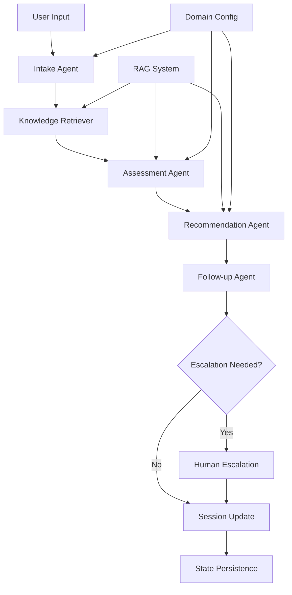

# LangGraph + RAG Coaching/Wellbeing MVP Architecture

**Generated**: 2025-01-14  
**Architecture Type**: Modular LangGraph + RAG Template  
**Domain**: Coaching & Wellbeing MVP  
**Architect**: Claude Code SuperClaude  

---

## 🎯 Executive Summary

Modular LangGraph architecture template for coaching/wellbeing applications with RAG-enhanced knowledge retrieval, stateful session management, and configurable domain-specific workflows. Designed for MVP deployment with clear scalability paths.

**Core Principles**:
- **Modularity**: Domain-agnostic core with pluggable coaching modules
- **Intelligence**: RAG-enhanced responses with evidence-based methodologies  
- **Stateful**: Persistent session tracking and progress monitoring
- **Scalability**: MVP-to-enterprise evolution path

---

## 🏗️ 1. System Architecture Overview

### High-Level Architecture


### Core Components Architecture
```python
# System Architecture Components
class CoachingGraphArchitecture:
    components = {
        "graph_engine": "LangGraph StateGraph",
        "state_management": "Persistent coaching state",
        "rag_system": "Multi-domain knowledge retrieval",
        "routing_logic": "Conditional coaching workflows",
        "domain_modules": "Pluggable coaching specializations",
        "escalation_system": "Human intervention protocols"
    }
```

---

## 🔧 2. Graph Nodes Design

### Node Workflow Specification
```python
from langgraph.graph import StateGraph
from typing import TypedDict, Literal, List, Optional
from datetime import datetime

class CoachingState(TypedDict):
    # User Context
    user_id: str
    session_id: str
    domain: Literal["life", "career", "wellness", "skill_development"]
    
    # Session Data
    user_input: str
    intake_data: dict
    conversation_history: List[dict]
    session_metadata: dict
    
    # Assessment Results
    needs_assessment: dict
    goal_clarity: float  # 0.0-1.0
    readiness_level: Literal["low", "medium", "high"]
    intervention_type: Literal["guidance", "structured", "intensive"]
    
    # Recommendations & Actions
    recommendations: List[dict]
    action_items: List[dict]
    resources: List[dict]
    next_steps: List[str]
    
    # Progress Tracking
    progress_metrics: dict
    milestone_tracking: dict
    engagement_score: float
    
    # Escalation & Quality
    escalation_triggers: List[str]
    quality_flags: List[str]
    human_review_required: bool
```

### Individual Node Implementations

#### **1. Intake Agent Node**
```python
async def intake_agent_node(state: CoachingState) -> CoachingState:
    """
    Purpose: Initial user engagement and context gathering
    Responsibilities:
    - Welcome and rapport building
    - Domain identification and routing
    - Initial goal articulation
    - Session preparation
    """
    
    # Domain detection and validation
    domain_classifier = DomainClassifier()
    detected_domain = domain_classifier.classify(state["user_input"])
    
    # Initial intake questionnaire adaptation
    intake_config = get_domain_config(detected_domain)["intake"]
    
    # Rapport building with domain-specific language
    rapport_builder = RapportBuilder(domain=detected_domain)
    welcome_message = rapport_builder.generate_welcome(state["user_input"])
    
    # Goal clarification prompts
    goal_clarifier = GoalClarifier(domain=detected_domain)
    clarifying_questions = goal_clarifier.generate_questions(state["user_input"])
    
    return {
        **state,
        "domain": detected_domain,
        "intake_data": {
            "domain_confidence": domain_classifier.confidence,
            "initial_goals": goal_clarifier.extract_goals(state["user_input"]),
            "intake_questions": clarifying_questions,
            "rapport_level": rapport_builder.assess_rapport()
        },
        "session_metadata": {
            "start_time": datetime.now(),
            "intake_completion": "partial",
            "engagement_signals": rapport_builder.engagement_indicators
        }
    }
```

#### **2. Knowledge Retriever Node**
```python
async def knowledge_retriever_node(state: CoachingState) -> CoachingState:
    """
    Purpose: RAG-enhanced knowledge retrieval for coaching context
    Responsibilities:
    - Domain-specific methodology retrieval
    - Evidence-based practice lookup
    - Personalization data integration
    - Resource library access
    """
    
    # Multi-vectorstore retrieval strategy
    rag_system = CoachingRAGSystem()
    
    # Domain-specific knowledge retrieval
    domain_knowledge = await rag_system.retrieve_domain_knowledge(
        domain=state["domain"],
        user_context=state["intake_data"],
        query=state["user_input"]
    )
    
    # Methodology matching
    relevant_methodologies = await rag_system.retrieve_methodologies(
        goals=state["intake_data"]["initial_goals"],
        domain=state["domain"],
        user_profile=state.get("user_profile", {})
    )
    
    # Best practices and case studies
    best_practices = await rag_system.retrieve_best_practices(
        situation=state["intake_data"],
        domain=state["domain"]
    )
    
    # Personalization insights
    personalization_data = await rag_system.retrieve_personalization_data(
        user_id=state["user_id"],
        domain=state["domain"],
        historical_preferences=state.get("user_preferences", {})
    )
    
    return {
        **state,
        "retrieved_knowledge": {
            "domain_knowledge": domain_knowledge,
            "methodologies": relevant_methodologies,
            "best_practices": best_practices,
            "personalization_insights": personalization_data,
            "retrieval_confidence": rag_system.confidence_score
        }
    }
```

#### **3. Assessment Agent Node**
```python
async def assessment_agent_node(state: CoachingState) -> CoachingState:
    """
    Purpose: Comprehensive coaching needs assessment
    Responsibilities:
    - Goal clarity assessment
    - Readiness evaluation
    - Intervention type determination
    - Progress baseline establishment
    """
    
    # Goal clarity assessment using validated frameworks
    goal_assessor = GoalClarityAssessor(
        domain=state["domain"],
        methodologies=state["retrieved_knowledge"]["methodologies"]
    )
    
    goal_clarity_score = goal_assessor.assess_clarity(
        stated_goals=state["intake_data"]["initial_goals"],
        context=state["user_input"],
        domain_knowledge=state["retrieved_knowledge"]["domain_knowledge"]
    )
    
    # Readiness assessment (TTM - Transtheoretical Model adaptation)
    readiness_assessor = ReadinessAssessor(domain=state["domain"])
    readiness_level = readiness_assessor.assess_readiness(
        user_input=state["user_input"],
        goal_clarity=goal_clarity_score,
        previous_attempts=state.get("user_history", {})
    )
    
    # Intervention type determination
    intervention_matcher = InterventionMatcher(
        domain=state["domain"],
        methodologies=state["retrieved_knowledge"]["methodologies"]
    )
    
    intervention_type = intervention_matcher.determine_intervention(
        goal_clarity=goal_clarity_score,
        readiness=readiness_level,
        user_preferences=state.get("user_preferences", {}),
        complexity=goal_assessor.complexity_score
    )
    
    # Progress baseline establishment
    baseline_assessor = BaselineAssessor(domain=state["domain"])
    baseline_metrics = baseline_assessor.establish_baseline(
        goals=state["intake_data"]["initial_goals"],
        current_state=state["user_input"],
        domain_standards=state["retrieved_knowledge"]["domain_knowledge"]
    )
    
    return {
        **state,
        "needs_assessment": {
            "goal_clarity": goal_clarity_score,
            "readiness_factors": readiness_assessor.factors,
            "intervention_rationale": intervention_matcher.rationale,
            "baseline_established": baseline_metrics,
            "assessment_confidence": goal_assessor.confidence
        },
        "goal_clarity": goal_clarity_score,
        "readiness_level": readiness_level,
        "intervention_type": intervention_type,
        "progress_metrics": {
            "baseline": baseline_metrics,
            "tracking_dimensions": baseline_assessor.tracking_dimensions,
            "measurement_frequency": baseline_assessor.recommended_frequency
        }
    }
```

#### **4. Recommendation Agent Node**
```python
async def recommendation_agent_node(state: CoachingState) -> CoachingState:
    """
    Purpose: Evidence-based recommendation generation
    Responsibilities:
    - Action plan creation
    - Resource recommendation
    - Methodology application
    - Personalized strategy development
    """
    
    # Strategy generator based on assessment
    strategy_generator = StrategyGenerator(
        domain=state["domain"],
        methodologies=state["retrieved_knowledge"]["methodologies"],
        best_practices=state["retrieved_knowledge"]["best_practices"]
    )
    
    # Core strategy development
    coaching_strategy = strategy_generator.generate_strategy(
        goals=state["intake_data"]["initial_goals"],
        assessment=state["needs_assessment"],
        intervention_type=state["intervention_type"],
        readiness_level=state["readiness_level"]
    )
    
    # Action plan creation
    action_planner = ActionPlanner(
        domain=state["domain"],
        intervention_type=state["intervention_type"]
    )
    
    action_items = action_planner.create_action_plan(
        strategy=coaching_strategy,
        goal_clarity=state["goal_clarity"],
        user_constraints=state.get("user_constraints", {}),
        timeline_preferences=state.get("timeline_preferences", "flexible")
    )
    
    # Resource recommendation engine
    resource_recommender = ResourceRecommender(
        domain=state["domain"],
        personalization_data=state["retrieved_knowledge"]["personalization_insights"]
    )
    
    recommended_resources = resource_recommender.recommend_resources(
        action_items=action_items,
        user_preferences=state.get("user_preferences", {}),
        accessibility_needs=state.get("accessibility_needs", {}),
        learning_style=state.get("learning_style", "mixed")
    )
    
    # Progress monitoring setup
    progress_monitor = ProgressMonitor(domain=state["domain"])
    monitoring_plan = progress_monitor.create_monitoring_plan(
        action_items=action_items,
        baseline_metrics=state["progress_metrics"]["baseline"],
        intervention_type=state["intervention_type"]
    )
    
    return {
        **state,
        "recommendations": {
            "coaching_strategy": coaching_strategy,
            "strategy_rationale": strategy_generator.rationale,
            "evidence_basis": strategy_generator.evidence_references,
            "confidence_score": strategy_generator.confidence
        },
        "action_items": action_items,
        "resources": recommended_resources,
        "next_steps": action_planner.immediate_next_steps,
        "monitoring_plan": monitoring_plan
    }
```

#### **5. Follow-up Agent Node**
```python
async def followup_agent_node(state: CoachingState) -> CoachingState:
    """
    Purpose: Session closure and follow-up planning
    Responsibilities:
    - Session summary generation
    - Commitment confirmation
    - Follow-up scheduling
    - Progress tracking setup
    """
    
    # Session summarizer
    session_summarizer = SessionSummarizer(domain=state["domain"])
    session_summary = session_summarizer.generate_summary(
        intake_data=state["intake_data"],
        assessment=state["needs_assessment"],
        recommendations=state["recommendations"],
        action_items=state["action_items"]
    )
    
    # Commitment builder
    commitment_builder = CommitmentBuilder(
        intervention_type=state["intervention_type"],
        readiness_level=state["readiness_level"]
    )
    
    commitment_plan = commitment_builder.build_commitments(
        action_items=state["action_items"],
        user_constraints=state.get("user_constraints", {}),
        accountability_preferences=state.get("accountability_preferences", "self")
    )
    
    # Follow-up scheduler
    followup_scheduler = FollowUpScheduler(domain=state["domain"])
    followup_plan = followup_scheduler.create_followup_schedule(
        intervention_type=state["intervention_type"],
        monitoring_plan=state["monitoring_plan"],
        user_availability=state.get("user_availability", {}),
        progress_check_frequency=state["progress_metrics"]["measurement_frequency"]
    )
    
    # Engagement tracker
    engagement_tracker = EngagementTracker()
    engagement_score = engagement_tracker.calculate_engagement(
        session_interactions=state["conversation_history"],
        commitment_level=commitment_builder.commitment_strength,
        question_responses=state["intake_data"]
    )
    
    return {
        **state,
        "session_summary": session_summary,
        "commitment_plan": commitment_plan,
        "followup_plan": followup_plan,
        "engagement_score": engagement_score,
        "session_completion": {
            "completed_at": datetime.now(),
            "next_session_recommended": followup_plan["next_session_date"],
            "interim_check_points": followup_plan["check_points"],
            "success_indicators": commitment_builder.success_metrics
        }
    }
```

#### **6. Human Escalation Node**
```python
async def human_escalation_node(state: CoachingState) -> CoachingState:
    """
    Purpose: Human intervention and professional handoff
    Responsibilities:
    - Escalation trigger evaluation
    - Professional notification
    - Context preparation for human coach
    - Escalation documentation
    """
    
    # Escalation evaluator
    escalation_evaluator = EscalationEvaluator(domain=state["domain"])
    
    # Evaluate escalation necessity
    escalation_analysis = escalation_evaluator.analyze_escalation_need(
        triggers=state["escalation_triggers"],
        session_complexity=state.get("session_complexity", "medium"),
        user_risk_factors=state.get("user_risk_factors", []),
        ai_confidence=state.get("ai_confidence_score", 0.8)
    )
    
    if escalation_analysis["requires_escalation"]:
        # Professional notification system
        notification_system = ProfessionalNotificationSystem()
        
        # Prepare context for human coach
        context_preparer = HumanHandoffPreparer(domain=state["domain"])
        handoff_package = context_preparer.prepare_handoff(
            full_session_state=state,
            escalation_reasons=escalation_analysis["reasons"],
            urgency_level=escalation_analysis["urgency"],
            recommended_specialist=escalation_analysis["specialist_type"]
        )
        
        # Execute notification
        notification_result = await notification_system.notify_professional(
            escalation_type=escalation_analysis["escalation_type"],
            urgency=escalation_analysis["urgency"],
            domain=state["domain"],
            handoff_package=handoff_package
        )
        
        return {
            **state,
            "human_review_required": True,
            "escalation_executed": True,
            "escalation_details": {
                "escalation_type": escalation_analysis["escalation_type"],
                "reasons": escalation_analysis["reasons"],
                "urgency": escalation_analysis["urgency"],
                "notification_sent": notification_result["success"],
                "assigned_professional": notification_result.get("assigned_to"),
                "escalation_timestamp": datetime.now()
            },
            "handoff_package": handoff_package
        }
    else:
        return {
            **state,
            "human_review_required": False,
            "escalation_executed": False,
            "escalation_evaluation": escalation_analysis
        }
```

---

## 🗃️ 3. State Management Design

### Persistent State Schema
```python
from sqlalchemy import Column, String, DateTime, JSON, Float, Boolean
from sqlalchemy.ext.declarative import declarative_base

Base = declarative_base()

class CoachingSession(Base):
    __tablename__ = 'coaching_sessions'
    
    # Session Identification
    session_id = Column(String, primary_key=True)
    user_id = Column(String, nullable=False, index=True)
    domain = Column(String, nullable=False)
    
    # Session Metadata
    created_at = Column(DateTime, nullable=False)
    updated_at = Column(DateTime, nullable=False)
    status = Column(String, default='active')  # active, completed, escalated, paused
    
    # Session State (JSON storage for flexibility)
    current_state = Column(JSON)  # Full CoachingState
    conversation_history = Column(JSON)
    
    # Key Metrics (extracted for querying)
    goal_clarity_score = Column(Float)
    engagement_score = Column(Float)
    readiness_level = Column(String)
    intervention_type = Column(String)
    
    # Escalation & Quality
    human_review_required = Column(Boolean, default=False)
    escalation_count = Column(Integer, default=0)
    quality_flags = Column(JSON)

class UserProfile(Base):
    __tablename__ = 'user_profiles'
    
    user_id = Column(String, primary_key=True)
    
    # User Preferences
    preferred_domains = Column(JSON)
    communication_style = Column(String)
    learning_style = Column(String)
    accountability_preferences = Column(String)
    
    # Historical Data
    session_count = Column(Integer, default=0)
    avg_engagement_score = Column(Float)
    preferred_intervention_types = Column(JSON)
    successful_methodologies = Column(JSON)
    
    # Progress Tracking
    long_term_goals = Column(JSON)
    milestone_achievements = Column(JSON)
    progress_trends = Column(JSON)

class ProgressTracking(Base):
    __tablename__ = 'progress_tracking'
    
    tracking_id = Column(String, primary_key=True)
    user_id = Column(String, nullable=False, index=True)
    session_id = Column(String, nullable=False)
    
    # Progress Metrics
    baseline_metrics = Column(JSON)
    current_metrics = Column(JSON)
    progress_delta = Column(JSON)
    
    # Tracking Configuration
    tracking_dimensions = Column(JSON)
    measurement_frequency = Column(String)
    next_measurement_due = Column(DateTime)
    
    # Progress Analysis
    trend_analysis = Column(JSON)
    milestone_status = Column(JSON)
    intervention_effectiveness = Column(Float)
```

### State Persistence Manager
```python
class StatePersistenceManager:
    def __init__(self, db_session):
        self.db = db_session
        
    async def save_session_state(self, state: CoachingState) -> None:
        """Persist complete session state to database"""
        
        session_record = CoachingSession(
            session_id=state["session_id"],
            user_id=state["user_id"],
            domain=state["domain"],
            current_state=state,
            conversation_history=state["conversation_history"],
            goal_clarity_score=state.get("goal_clarity", 0.0),
            engagement_score=state.get("engagement_score", 0.0),
            readiness_level=state.get("readiness_level", "medium"),
            intervention_type=state.get("intervention_type", "guidance"),
            human_review_required=state.get("human_review_required", False),
            quality_flags=state.get("quality_flags", []),
            updated_at=datetime.now()
        )
        
        self.db.merge(session_record)
        await self.db.commit()
        
    async def load_session_state(self, session_id: str) -> CoachingState:
        """Load complete session state from database"""
        
        session_record = await self.db.query(CoachingSession).filter(
            CoachingSession.session_id == session_id
        ).first()
        
        if session_record:
            return session_record.current_state
        else:
            raise SessionNotFoundError(f"Session {session_id} not found")
            
    async def update_progress_tracking(self, state: CoachingState) -> None:
        """Update progress tracking metrics"""
        
        if "progress_metrics" in state:
            progress_record = ProgressTracking(
                tracking_id=f"{state['user_id']}_{state['session_id']}",
                user_id=state["user_id"],
                session_id=state["session_id"],
                baseline_metrics=state["progress_metrics"]["baseline"],
                current_metrics=state["progress_metrics"].get("current", {}),
                tracking_dimensions=state["progress_metrics"]["tracking_dimensions"],
                measurement_frequency=state["progress_metrics"]["measurement_frequency"],
                next_measurement_due=self._calculate_next_measurement(
                    state["progress_metrics"]["measurement_frequency"]
                )
            )
            
            self.db.merge(progress_record)
            await self.db.commit()
```

---

## 🧠 4. RAG Integration Specification

### Multi-Domain Knowledge Architecture
```python
class CoachingRAGSystem:
    def __init__(self):
        self.vectorstores = self._initialize_vectorstores()
        self.embeddings = OpenAIEmbeddings()
        self.retrievers = self._configure_retrievers()
        
    def _initialize_vectorstores(self) -> dict:
        """Initialize domain-specific vectorstores"""
        return {
            # Core coaching methodologies
            "methodologies": Chroma(
                collection_name="coaching_methodologies",
                embedding_function=self.embeddings,
                persist_directory="./vectorstore/methodologies"
            ),
            
            # Evidence-based practices
            "best_practices": Chroma(
                collection_name="coaching_best_practices", 
                embedding_function=self.embeddings,
                persist_directory="./vectorstore/practices"
            ),
            
            # Resource library
            "resources": Chroma(
                collection_name="coaching_resources",
                embedding_function=self.embeddings,
                persist_directory="./vectorstore/resources"
            ),
            
            # Domain-specific knowledge
            "domain_knowledge": {
                "life_coaching": Chroma(
                    collection_name="life_coaching_knowledge",
                    embedding_function=self.embeddings,
                    persist_directory="./vectorstore/life_coaching"
                ),
                "career_coaching": Chroma(
                    collection_name="career_coaching_knowledge",
                    embedding_function=self.embeddings,
                    persist_directory="./vectorstore/career_coaching"
                ),
                "wellness_coaching": Chroma(
                    collection_name="wellness_coaching_knowledge",
                    embedding_function=self.embeddings,
                    persist_directory="./vectorstore/wellness_coaching"
                ),
                "skill_development": Chroma(
                    collection_name="skill_development_knowledge",
                    embedding_function=self.embeddings,
                    persist_directory="./vectorstore/skill_development"
                )
            },
            
            # Personalization data
            "personalization": Chroma(
                collection_name="personalization_patterns",
                embedding_function=self.embeddings,
                persist_directory="./vectorstore/personalization"
            )
        }
```

### Knowledge Retrieval Strategies
```python
async def retrieve_domain_knowledge(
    self, 
    domain: str, 
    user_context: dict, 
    query: str,
    k: int = 5
) -> List[dict]:
    """Retrieve domain-specific coaching knowledge"""
    
    # Domain-specific retriever
    domain_vectorstore = self.vectorstores["domain_knowledge"][domain]
    
    # Context-enhanced query
    enhanced_query = self._enhance_query_with_context(query, user_context, domain)
    
    # Semantic retrieval with metadata filtering
    retrieval_results = await domain_vectorstore.asimilarity_search_with_score(
        query=enhanced_query,
        k=k,
        filter={
            "domain": domain,
            "quality_score": {"$gte": 0.8},  # High-quality content only
            "evidence_level": {"$in": ["research-based", "expert-validated"]}
        }
    )
    
    # Relevance scoring and ranking
    scored_results = self._score_relevance(retrieval_results, user_context)
    
    return scored_results

async def retrieve_methodologies(
    self,
    goals: List[str],
    domain: str,
    user_profile: dict,
    k: int = 3
) -> List[dict]:
    """Retrieve relevant coaching methodologies"""
    
    # Methodology-specific retrieval
    methodology_store = self.vectorstores["methodologies"]
    
    # Multi-goal query construction
    methodology_query = self._construct_methodology_query(goals, domain, user_profile)
    
    # Retrieve with methodology-specific filters
    methodology_results = await methodology_store.asimilarity_search_with_score(
        query=methodology_query,
        k=k,
        filter={
            "applicable_domains": {"$in": [domain, "universal"]},
            "evidence_strength": {"$gte": "moderate"},
            "complexity_level": self._determine_suitable_complexity(user_profile)
        }
    )
    
    # Methodology compatibility scoring
    compatible_methodologies = self._score_methodology_compatibility(
        methodology_results, 
        goals, 
        user_profile
    )
    
    return compatible_methodologies

async def retrieve_personalization_data(
    self,
    user_id: str,
    domain: str,
    historical_preferences: dict
) -> dict:
    """Retrieve personalization insights for user"""
    
    # User-specific pattern retrieval
    personalization_store = self.vectorstores["personalization"]
    
    # Create personalization query
    personalization_query = self._create_personalization_query(
        user_id, 
        domain, 
        historical_preferences
    )
    
    # Retrieve similar user patterns
    similar_patterns = await personalization_store.asimilarity_search_with_score(
        query=personalization_query,
        k=10,
        filter={
            "domain": domain,
            "success_rate": {"$gte": 0.7},  # Successful patterns only
            "sample_size": {"$gte": 5}      # Statistically relevant
        }
    )
    
    # Analyze patterns for personalization insights
    personalization_insights = self._analyze_personalization_patterns(
        similar_patterns,
        historical_preferences
    )
    
    return personalization_insights
```

### Knowledge Base Population
```python
class CoachingKnowledgePopulator:
    """Populate vectorstores with coaching knowledge"""
    
    def __init__(self, rag_system: CoachingRAGSystem):
        self.rag_system = rag_system
        
    async def populate_methodologies(self):
        """Populate coaching methodologies vectorstore"""
        
        methodologies = [
            # GROW Model
            {
                "name": "GROW Model",
                "description": "Goal, Reality, Options, Will - structured coaching conversation",
                "applicable_domains": ["life_coaching", "career_coaching", "skill_development"],
                "evidence_strength": "strong",
                "complexity_level": "beginner",
                "methodology_steps": [
                    "Goal: What do you want to achieve?",
                    "Reality: What is your current situation?", 
                    "Options: What could you do?",
                    "Will: What will you do?"
                ],
                "effectiveness_research": "Whitmore (2017) - 85% goal achievement rate",
                "best_use_cases": ["Goal clarification", "Action planning", "Problem solving"]
            },
            
            # Solution-Focused Brief Therapy
            {
                "name": "Solution-Focused Coaching",
                "description": "Focus on solutions rather than problems",
                "applicable_domains": ["life_coaching", "wellness_coaching"],
                "evidence_strength": "strong",
                "complexity_level": "intermediate",
                "key_techniques": [
                    "Miracle question",
                    "Scaling questions",
                    "Exception finding",
                    "Goal setting"
                ],
                "effectiveness_research": "De Shazer & Dolan (2007) - 80% positive outcomes",
                "best_use_cases": ["Overcoming obstacles", "Building on strengths", "Quick wins"]
            },
            
            # Cognitive Behavioral Coaching
            {
                "name": "Cognitive Behavioral Coaching",
                "description": "Address thinking patterns and behaviors",
                "applicable_domains": ["life_coaching", "wellness_coaching", "skill_development"],
                "evidence_strength": "very_strong",
                "complexity_level": "advanced",
                "core_components": [
                    "Thought awareness",
                    "Cognitive restructuring",
                    "Behavioral experiments",
                    "Homework assignments"
                ],
                "effectiveness_research": "Palmer & Szymanska (2007) - 78% sustained change",
                "best_use_cases": ["Limiting beliefs", "Behavioral change", "Skill building"]
            }
        ]
        
        # Add methodologies to vectorstore
        for methodology in methodologies:
            await self.rag_system.vectorstores["methodologies"].aadd_texts(
                texts=[methodology["description"]],
                metadatas=[methodology]
            )
    
    async def populate_domain_knowledge(self, domain: str):
        """Populate domain-specific knowledge"""
        
        domain_knowledge = {
            "life_coaching": [
                {
                    "topic": "Life Transition Coaching",
                    "content": "Supporting individuals through major life changes...",
                    "evidence_level": "research-based",
                    "quality_score": 0.9,
                    "source": "International Coach Federation Research"
                }
            ],
            "career_coaching": [
                {
                    "topic": "Career Change Strategy",
                    "content": "Systematic approach to career transition...",
                    "evidence_level": "expert-validated", 
                    "quality_score": 0.85,
                    "source": "Career Development Institute"
                }
            ]
        }
        
        knowledge_items = domain_knowledge.get(domain, [])
        
        for item in knowledge_items:
            await self.rag_system.vectorstores["domain_knowledge"][domain].aadd_texts(
                texts=[item["content"]],
                metadatas=[item]
            )
```

---

## 🔀 5. Conditional Routing Logic

### Graph Routing Configuration
```python
from langgraph.graph import StateGraph

class CoachingWorkflowRouter:
    def __init__(self):
        self.graph = StateGraph(CoachingState)
        self._build_graph()
        
    def _build_graph(self):
        """Build the coaching workflow graph with conditional routing"""
        
        # Add all nodes
        self.graph.add_node("intake_agent", intake_agent_node)
        self.graph.add_node("knowledge_retriever", knowledge_retriever_node)
        self.graph.add_node("assessment_agent", assessment_agent_node)
        self.graph.add_node("recommendation_agent", recommendation_agent_node)
        self.graph.add_node("followup_agent", followup_agent_node)
        self.graph.add_node("human_escalation", human_escalation_node)
        
        # Set entry point
        self.graph.set_entry_point("intake_agent")
        
        # Linear flow for standard path
        self.graph.add_edge("intake_agent", "knowledge_retriever")
        self.graph.add_edge("knowledge_retriever", "assessment_agent")
        
        # Conditional routing after assessment
        self.graph.add_conditional_edges(
            "assessment_agent",
            self._route_after_assessment,
            {
                "standard_recommendations": "recommendation_agent",
                "human_escalation": "human_escalation",
                "additional_assessment": "assessment_agent"  # Loop back for complex cases
            }
        )
        
        # Conditional routing after recommendations
        self.graph.add_conditional_edges(
            "recommendation_agent", 
            self._route_after_recommendations,
            {
                "followup": "followup_agent",
                "human_review": "human_escalation",
                "reassess": "assessment_agent"
            }
        )
        
        # Conditional routing after follow-up
        self.graph.add_conditional_edges(
            "followup_agent",
            self._route_after_followup,
            {
                "complete": "END",
                "escalate": "human_escalation"
            }
        )
        
        # Human escalation always leads to completion
        self.graph.add_edge("human_escalation", "END")

    def _route_after_assessment(self, state: CoachingState) -> str:
        """Determine routing after assessment phase"""
        
        # Check for immediate escalation triggers
        escalation_triggers = state.get("escalation_triggers", [])
        if escalation_triggers:
            high_priority_triggers = [
                "crisis_indicators", 
                "beyond_scope", 
                "requires_professional"
            ]
            if any(trigger in high_priority_triggers for trigger in escalation_triggers):
                return "human_escalation"
        
        # Check goal clarity and complexity
        goal_clarity = state.get("goal_clarity", 0.5)
        assessment = state.get("needs_assessment", {})
        
        if goal_clarity < 0.3:
            # Very low goal clarity - need more assessment
            return "additional_assessment"
        elif goal_clarity >= 0.7 and assessment.get("assessment_confidence", 0) > 0.8:
            # Clear goals and confident assessment - proceed to recommendations
            return "standard_recommendations"
        elif 0.3 <= goal_clarity < 0.7:
            # Moderate clarity - can proceed but may need iteration
            return "standard_recommendations"
        else:
            # Edge case - default to human escalation
            return "human_escalation"

    def _route_after_recommendations(self, state: CoachingState) -> str:
        """Determine routing after recommendation phase"""
        
        recommendations = state.get("recommendations", {})
        confidence_score = recommendations.get("confidence_score", 0.0)
        
        # Check AI confidence in recommendations
        if confidence_score < 0.6:
            return "human_review"
            
        # Check for complex intervention requirements
        intervention_type = state.get("intervention_type", "guidance")
        if intervention_type == "intensive":
            return "human_review"
            
        # Check for user-specific escalation needs
        if state.get("user_risk_factors", []):
            return "human_review"
            
        # Check recommendation complexity
        action_items = state.get("action_items", [])
        if len(action_items) > 8:  # Too many action items may indicate complexity
            return "reassess"
            
        # Standard path - proceed to follow-up
        return "followup"

    def _route_after_followup(self, state: CoachingState) -> str:
        """Determine routing after follow-up phase"""
        
        # Check if human review was flagged during follow-up
        if state.get("human_review_required", False):
            return "escalate"
            
        # Check engagement score
        engagement_score = state.get("engagement_score", 0.5)
        if engagement_score < 0.3:
            # Low engagement may require human intervention
            return "escalate"
            
        # Check follow-up plan feasibility
        followup_plan = state.get("followup_plan", {})
        if followup_plan.get("complexity_flag", False):
            return "escalate"
            
        # Standard completion
        return "complete"
```

### Domain-Specific Routing Customization
```python
class DomainRoutingCustomizer:
    """Customize routing logic for different coaching domains"""
    
    @staticmethod
    def customize_for_domain(domain: str, base_router: CoachingWorkflowRouter):
        """Apply domain-specific routing customizations"""
        
        if domain == "wellness_coaching":
            # Wellness coaching may require health professional oversight
            base_router._route_after_assessment = WellnessRoutingLogic.route_after_assessment
            base_router._escalation_threshold = 0.5  # Lower threshold for health concerns
            
        elif domain == "career_coaching":
            # Career coaching may involve industry-specific expertise
            base_router._route_after_recommendations = CareerRoutingLogic.route_after_recommendations
            base_router._industry_specialization_check = True
            
        elif domain == "skill_development":
            # Skill development may require competency validation
            base_router._route_after_followup = SkillRoutingLogic.route_after_followup
            base_router._competency_validation = True
            
        return base_router

class WellnessRoutingLogic:
    @staticmethod
    def route_after_assessment(state: CoachingState) -> str:
        """Wellness-specific routing logic"""
        
        # Check for health-related concerns
        user_input = state.get("user_input", "").lower()
        health_indicators = [
            "depression", "anxiety", "medication", "therapy",
            "doctor", "physician", "mental health", "physical pain"
        ]
        
        if any(indicator in user_input for indicator in health_indicators):
            return "human_escalation"
            
        # Standard wellness coaching can proceed
        goal_clarity = state.get("goal_clarity", 0.5)
        return "standard_recommendations" if goal_clarity >= 0.4 else "additional_assessment"
```

---

## 🔧 6. Domain Configuration Modules

### Domain Module Architecture
```python
from abc import ABC, abstractmethod

class CoachingDomainModule(ABC):
    """Abstract base class for coaching domain modules"""
    
    def __init__(self, domain_name: str):
        self.domain_name = domain_name
        self.config = self._load_domain_config()
        
    @abstractmethod
    def get_intake_configuration(self) -> dict:
        """Return domain-specific intake configuration"""
        pass
        
    @abstractmethod
    def get_assessment_framework(self) -> dict:
        """Return domain-specific assessment framework"""
        pass
        
    @abstractmethod
    def get_methodology_preferences(self) -> List[str]:
        """Return preferred methodologies for this domain"""
        pass
        
    @abstractmethod
    def get_escalation_triggers(self) -> List[str]:
        """Return domain-specific escalation triggers"""
        pass
        
    @abstractmethod
    def customize_recommendations(self, base_recommendations: dict) -> dict:
        """Customize recommendations for domain"""
        pass

class LifeCoachingModule(CoachingDomainModule):
    """Life coaching domain module"""
    
    def __init__(self):
        super().__init__("life_coaching")
        
    def get_intake_configuration(self) -> dict:
        return {
            "initial_questions": [
                "What area of your life would you like to focus on improving?",
                "What does success look like to you in this area?",
                "What challenges are you currently facing?",
                "What support systems do you have in place?"
            ],
            "goal_categories": [
                "Personal relationships",
                "Work-life balance", 
                "Personal growth",
                "Health and wellness",
                "Life transitions",
                "Purpose and meaning"
            ],
            "assessment_dimensions": [
                "life_satisfaction",
                "goal_clarity", 
                "motivation_level",
                "support_systems",
                "change_readiness"
            ]
        }
        
    def get_assessment_framework(self) -> dict:
        return {
            "primary_assessments": [
                {
                    "name": "Life Wheel Assessment",
                    "categories": [
                        "career", "finances", "health", "relationships",
                        "personal_growth", "recreation", "environment", "contribution"
                    ],
                    "scoring": "1-10 satisfaction scale"
                },
                {
                    "name": "Values Clarification",
                    "method": "values_card_sort",
                    "top_values_count": 5
                },
                {
                    "name": "Goal Setting Readiness",
                    "dimensions": ["specificity", "motivation", "resources", "timeline"]
                }
            ],
            "baseline_metrics": [
                "current_satisfaction_scores",
                "identified_values",
                "goal_clarity_index",
                "change_confidence_level"
            ]
        }
        
    def get_methodology_preferences(self) -> List[str]:
        return [
            "GROW Model",
            "Solution-Focused Coaching", 
            "Values-Based Coaching",
            "Appreciative Inquiry",
            "Wheel of Life"
        ]
        
    def get_escalation_triggers(self) -> List[str]:
        return [
            "mental_health_concerns",
            "relationship_violence",
            "substance_abuse_indicators",
            "financial_crisis_beyond_coaching",
            "legal_issues",
            "medical_concerns"
        ]
        
    def customize_recommendations(self, base_recommendations: dict) -> dict:
        """Customize recommendations for life coaching"""
        
        customized = base_recommendations.copy()
        
        # Add life coaching specific resources
        customized["resources"].extend([
            {
                "type": "assessment_tool",
                "name": "Life Wheel Template", 
                "description": "Visual tool for life balance assessment",
                "format": "pdf"
            },
            {
                "type": "app",
                "name": "Values in Action Survey",
                "description": "Character strengths assessment",
                "url": "https://www.viacharacter.org"
            }
        ])
        
        # Customize action items for life coaching context
        life_coaching_actions = []
        for action in customized["action_items"]:
            if action["category"] == "goal_setting":
                action["methodology"] = "SMART + Values alignment"
            elif action["category"] == "self_reflection":
                action["tools"] = ["journaling", "values_reflection", "life_wheel_review"]
            life_coaching_actions.append(action)
            
        customized["action_items"] = life_coaching_actions
        
        return customized

class CareerCoachingModule(CoachingDomainModule):
    """Career coaching domain module"""
    
    def __init__(self):
        super().__init__("career_coaching")
        
    def get_intake_configuration(self) -> dict:
        return {
            "initial_questions": [
                "What is your current career situation?",
                "What are your career goals or aspirations?", 
                "What challenges are you facing in your career?",
                "What skills or experiences do you want to develop?"
            ],
            "career_focus_areas": [
                "Career change/transition",
                "Leadership development",
                "Skill building",
                "Work-life balance",
                "Performance improvement",
                "Promotion/advancement",
                "Entrepreneurship"
            ],
            "assessment_dimensions": [
                "career_satisfaction",
                "skill_assessment",
                "market_awareness",
                "networking_strength",
                "goal_specificity"
            ]
        }
        
    def get_assessment_framework(self) -> dict:
        return {
            "primary_assessments": [
                {
                    "name": "Career Values Assessment",
                    "values_categories": [
                        "autonomy", "security", "achievement", "relationships",
                        "service", "variety", "creativity", "leadership"
                    ]
                },
                {
                    "name": "Skills Gap Analysis", 
                    "method": "current_vs_target_skills",
                    "skill_categories": ["technical", "leadership", "communication", "industry_specific"]
                },
                {
                    "name": "Career Stage Assessment",
                    "stages": ["exploration", "establishment", "advancement", "maintenance", "transition"]
                }
            ],
            "baseline_metrics": [
                "career_satisfaction_index",
                "skill_proficiency_scores",
                "market_position_assessment",
                "goal_achievement_probability"
            ]
        }
        
    def get_methodology_preferences(self) -> List[str]:
        return [
            "GROW Model",
            "SWOT Analysis",
            "Career Action Planning", 
            "Informational Interviewing",
            "Skills-Based Coaching",
            "Network Mapping"
        ]
        
    def get_escalation_triggers(self) -> List[str]:
        return [
            "workplace_harassment",
            "legal_employment_issues",
            "severe_workplace_stress",
            "discrimination_concerns",
            "requires_industry_expertise",
            "complex_negotiation_needs"
        ]
        
    def customize_recommendations(self, base_recommendations: dict) -> dict:
        """Customize recommendations for career coaching"""
        
        customized = base_recommendations.copy()
        
        # Add career-specific resources
        customized["resources"].extend([
            {
                "type": "assessment_tool",
                "name": "Skills Inventory Worksheet",
                "description": "Comprehensive skills assessment tool",
                "format": "excel"
            },
            {
                "type": "website",
                "name": "LinkedIn Learning",
                "description": "Professional skill development courses",
                "url": "https://linkedin.com/learning"
            },
            {
                "type": "template",
                "name": "Career Action Plan Template",
                "description": "Structured career planning framework"
            }
        ])
        
        # Add industry networking recommendations
        if "networking" in str(customized["action_items"]).lower():
            customized["action_items"].append({
                "title": "Industry Networking Strategy",
                "description": "Develop systematic approach to industry networking",
                "priority": "medium",
                "timeline": "2-4 weeks",
                "methodology": "Network Mapping + Informational Interviewing"
            })
            
        return customized

class WellnessCoachingModule(CoachingDomainModule):
    """Wellness coaching domain module"""
    
    def __init__(self):
        super().__init__("wellness_coaching")
        
    def get_intake_configuration(self) -> dict:
        return {
            "initial_questions": [
                "What aspects of wellness are you looking to improve?",
                "What does optimal health and wellbeing mean to you?",
                "What wellness challenges are you currently facing?",
                "What healthy habits do you already have in place?"
            ],
            "wellness_dimensions": [
                "Physical health",
                "Mental/emotional health",
                "Nutrition",
                "Exercise/movement",
                "Sleep",
                "Stress management",
                "Social connections",
                "Spiritual/purpose"
            ],
            "health_considerations": [
                "existing_health_conditions",
                "medications",
                "healthcare_provider_involvement",
                "previous_wellness_attempts"
            ]
        }
        
    def get_assessment_framework(self) -> dict:
        return {
            "primary_assessments": [
                {
                    "name": "Wellness Wheel Assessment", 
                    "dimensions": [
                        "physical", "emotional", "intellectual", "social",
                        "spiritual", "environmental", "occupational", "financial"
                    ]
                },
                {
                    "name": "Readiness for Change Assessment",
                    "model": "Transtheoretical_Model",
                    "stages": ["precontemplation", "contemplation", "preparation", "action", "maintenance"]
                },
                {
                    "name": "Health Behavior Analysis",
                    "focus_areas": ["nutrition", "exercise", "sleep", "stress", "relationships"]
                }
            ],
            "baseline_metrics": [
                "wellness_dimension_scores",
                "change_readiness_stage",
                "current_health_behaviors",
                "motivation_level"
            ]
        }
        
    def get_methodology_preferences(self) -> List[str]:
        return [
            "Health Behavior Change Model",
            "Motivational Interviewing",
            "SMART Goal Setting",
            "Habit Stacking",
            "Mindfulness-Based Coaching"
        ]
        
    def get_escalation_triggers(self) -> List[str]:
        return [
            "medical_symptoms_requiring_diagnosis",
            "eating_disorder_indicators", 
            "severe_mental_health_symptoms",
            "medication_related_concerns",
            "requires_medical_clearance",
            "dangerous_health_behaviors"
        ]
        
    def customize_recommendations(self, base_recommendations: dict) -> dict:
        """Customize recommendations for wellness coaching"""
        
        customized = base_recommendations.copy()
        
        # Add wellness-specific disclaimer
        customized["disclaimer"] = (
            "This coaching is not intended to replace medical advice. "
            "Please consult with healthcare providers for medical concerns."
        )
        
        # Add wellness-specific resources
        customized["resources"].extend([
            {
                "type": "app",
                "name": "MyFitnessPal",
                "description": "Nutrition tracking and meal planning",
                "category": "nutrition"
            },
            {
                "type": "app", 
                "name": "Headspace",
                "description": "Meditation and mindfulness practices",
                "category": "mental_wellness"
            },
            {
                "type": "website",
                "name": "CDC Physical Activity Guidelines",
                "description": "Evidence-based exercise recommendations",
                "url": "https://cdc.gov/physicalactivity"
            }
        ])
        
        return customized
```

### Domain Configuration Registry
```python
class DomainConfigurationRegistry:
    """Central registry for domain modules"""
    
    def __init__(self):
        self.domains = {
            "life_coaching": LifeCoachingModule(),
            "career_coaching": CareerCoachingModule(), 
            "wellness_coaching": WellnessCoachingModule(),
            "skill_development": SkillDevelopmentModule()  # To be implemented
        }
        
    def get_domain_module(self, domain: str) -> CoachingDomainModule:
        """Get domain module by name"""
        if domain not in self.domains:
            raise ValueError(f"Domain '{domain}' not supported")
        return self.domains[domain]
        
    def register_domain(self, domain: str, module: CoachingDomainModule):
        """Register new domain module"""
        self.domains[domain] = module
        
    def list_supported_domains(self) -> List[str]:
        """List all supported domains"""
        return list(self.domains.keys())
        
    def get_domain_config(self, domain: str) -> dict:
        """Get complete domain configuration"""
        module = self.get_domain_module(domain)
        return {
            "intake": module.get_intake_configuration(),
            "assessment": module.get_assessment_framework(),
            "methodologies": module.get_methodology_preferences(),
            "escalation_triggers": module.get_escalation_triggers()
        }
```

---

## 🚀 7. MVP Scope & Implementation Roadmap

### MVP Feature Scope
```yaml
# Core MVP Features (Week 1-4)
core_features:
  graph_workflow:
    - Basic 6-node workflow (intake → knowledge → assessment → recommendation → followup → escalation)
    - Linear routing with simple conditional logic
    - State persistence in PostgreSQL
    
  single_domain:
    - Life coaching domain only
    - Basic GROW model implementation
    - Simple goal clarity assessment
    
  basic_rag:
    - Single vectorstore with coaching methodologies
    - Simple semantic search
    - 50 curated methodology documents
    
  minimal_ui:
    - REST API endpoints
    - JSON input/output
    - Basic error handling

# Enhanced MVP Features (Week 5-8)  
enhanced_features:
  multi_domain:
    - Add career coaching domain
    - Domain-specific routing logic
    - Domain configuration system
    
  advanced_rag:
    - Multi-vectorstore architecture
    - Domain-specific knowledge bases
    - Relevance scoring and ranking
    
  progress_tracking:
    - Basic session persistence
    - Simple progress metrics
    - Follow-up scheduling
    
  escalation_system:
    - Rule-based escalation triggers
    - Human notification system
    - Professional handoff workflow

# Production Ready Features (Week 9-12)
production_features:
  full_domain_support:
    - All 4 coaching domains
    - Dynamic domain detection
    - Cross-domain insights
    
  sophisticated_rag:
    - Personalization vectorstore
    - User preference learning
    - Evidence-based recommendations
    
  monitoring:
    - Performance metrics
    - Quality assurance
    - User satisfaction tracking
    
  scalability:
    - Caching layer
    - Rate limiting
    - Load balancing
```

### MVP Implementation Plan

#### **Phase 1: Core Infrastructure (Week 1-2)**
```python
# Week 1: Basic LangGraph Setup
deliverables_week_1 = {
    "environment_setup": [
        "Python 3.11+ with LangGraph",
        "PostgreSQL database",
        "Vector database (Chroma)",
        "Development environment"
    ],
    "basic_graph": [
        "CoachingState definition",
        "6 basic nodes implementation",
        "Linear workflow routing",
        "Simple state persistence"
    ],
    "infrastructure": [
        "Database schema creation",
        "Basic API endpoints",
        "Error handling framework",
        "Logging system"
    ]
}

# Week 2: Basic RAG Integration
deliverables_week_2 = {
    "rag_system": [
        "Single Chroma vectorstore setup",
        "Basic embedding generation",
        "Simple semantic retrieval",
        "Knowledge base population script"
    ],
    "domain_module": [
        "LifeCoachingModule implementation",
        "Basic intake configuration", 
        "Simple assessment framework",
        "GROW model integration"
    ],
    "testing": [
        "Unit tests for core components",
        "Integration tests for workflow",
        "Basic performance testing",
        "Error scenario testing"
    ]
}
```

#### **Phase 2: Enhanced Functionality (Week 3-4)**
```python
# Week 3: Advanced Workflow Logic
deliverables_week_3 = {
    "conditional_routing": [
        "Goal clarity assessment routing",
        "Escalation trigger evaluation", 
        "Domain-specific routing logic",
        "Loop-back for complex cases"
    ],
    "enhanced_nodes": [
        "Sophisticated assessment logic",
        "Evidence-based recommendations",
        "Personalized action planning",
        "Progress tracking setup"
    ],
    "quality_assurance": [
        "Response validation framework",
        "Quality scoring system",
        "Escalation trigger testing",
        "Domain expertise validation"
    ]
}

# Week 4: Multi-Domain Support
deliverables_week_4 = {
    "domain_expansion": [
        "CareerCoachingModule implementation",
        "Domain detection logic",
        "Cross-domain configuration",
        "Domain-specific knowledge bases"
    ],
    "advanced_rag": [
        "Multi-vectorstore architecture",
        "Domain-specific retrieval",
        "Relevance scoring system",
        "Knowledge base expansion"
    ],
    "user_experience": [
        "Improved intake flow",
        "Better recommendation formatting",
        "Enhanced follow-up planning",
        "User preference capturing"
    ]
}
```

### MVP Architecture Diagram
```python
# MVP System Components
mvp_architecture = {
    "api_layer": {
        "framework": "FastAPI",
        "endpoints": [
            "POST /coaching/session/start",
            "POST /coaching/session/continue", 
            "GET /coaching/session/{id}",
            "POST /coaching/domains/detect"
        ]
    },
    
    "workflow_engine": {
        "framework": "LangGraph",
        "components": [
            "StateGraph with 6 nodes",
            "Conditional routing logic",
            "State persistence manager",
            "Domain configuration system"
        ]
    },
    
    "knowledge_system": {
        "vectorstore": "Chroma",
        "embeddings": "OpenAI Ada-002",
        "knowledge_bases": [
            "coaching_methodologies",
            "life_coaching_knowledge", 
            "career_coaching_knowledge"
        ]
    },
    
    "data_layer": {
        "primary_db": "PostgreSQL",
        "caching": "Redis",
        "storage_components": [
            "coaching_sessions",
            "user_profiles",
            "progress_tracking"
        ]
    }
}
```

### Success Metrics for MVP
```yaml
# Technical Performance Metrics
performance_targets:
  response_time: "<5 seconds end-to-end"
  availability: ">99% uptime"
  throughput: ">100 sessions/hour"
  
# Quality Metrics  
quality_targets:
  goal_clarity_improvement: ">30% average increase"
  user_satisfaction: ">4.0/5 rating"
  escalation_accuracy: ">90% appropriate escalations"
  
# Adoption Metrics
adoption_targets:
  session_completion_rate: ">80%"
  follow_up_engagement: ">60%"
  domain_coverage: "2+ domains active"
```

---

## 🔄 8. Scalability & Extension Framework

### Horizontal Scaling Architecture
```python
class ScalableCoachingArchitecture:
    """Architecture design for scaling beyond MVP"""
    
    def __init__(self):
        self.scaling_dimensions = {
            "domain_scaling": self._design_domain_scaling(),
            "user_scaling": self._design_user_scaling(),
            "knowledge_scaling": self._design_knowledge_scaling(),
            "performance_scaling": self._design_performance_scaling()
        }
    
    def _design_domain_scaling(self) -> dict:
        """Design for adding new coaching domains"""
        return {
            "plugin_architecture": {
                "description": "Domain modules as pluggable components",
                "interface": "CoachingDomainModule abstract base class",
                "registration": "DomainConfigurationRegistry",
                "hot_loading": "Runtime domain module loading"
            },
            "knowledge_isolation": {
                "strategy": "Domain-specific vectorstores",
                "naming_convention": "{domain}_knowledge",
                "cross_domain_insights": "Universal knowledge vectorstore"
            },
            "routing_customization": {
                "method": "Domain-specific routing logic override",
                "fallback": "Universal routing for unknown domains",
                "learning": "Domain preference learning from usage"
            }
        }
    
    def _design_user_scaling(self) -> dict:
        """Design for scaling to thousands of users"""
        return {
            "session_management": {
                "strategy": "Distributed session storage",
                "technology": "Redis Cluster with persistence",
                "partitioning": "User ID based sharding"
            },
            "personalization_scaling": {
                "approach": "User embeddings in separate vectorstore",
                "clustering": "Similar user pattern clustering",
                "recommendation_cache": "Personalized recommendation caching"
            },
            "load_balancing": {
                "strategy": "Stateless API with sticky sessions for workflows",
                "technology": "HAProxy/Nginx with Redis session store",
                "scaling_trigger": "CPU/Memory thresholds"
            }
        }
        
    def _design_knowledge_scaling(self) -> dict:
        """Design for scaling knowledge base to thousands of documents"""
        return {
            "vectorstore_scaling": {
                "strategy": "Hierarchical vectorstore architecture",
                "levels": ["domain", "methodology", "specialization"],
                "technology": "Chroma with distributed storage"
            },
            "knowledge_curation": {
                "quality_gates": "Automated quality scoring",
                "expert_review": "Human expert validation workflow",
                "version_management": "Knowledge base versioning"
            },
            "retrieval_optimization": {
                "caching": "Query result caching with TTL",
                "indexing": "Multi-level indexing strategy", 
                "precomputation": "Popular query precomputation"
            }
        }
    
    def _design_performance_scaling(self) -> dict:
        """Design for high-performance operation"""
        return {
            "caching_strategy": {
                "levels": ["API response", "RAG results", "Graph state"],
                "technologies": ["Redis", "Memcached", "In-memory cache"],
                "invalidation": "Smart cache invalidation strategies"
            },
            "async_processing": {
                "strategy": "Async graph execution with checkpointing",
                "technology": "Celery for background tasks",
                "monitoring": "Task queue monitoring and alerting"
            },
            "database_optimization": {
                "read_replicas": "Multiple read replicas for queries",
                "partitioning": "Time-based session partitioning",
                "indexing": "Optimized indexing strategy"
            }
        }
```

### Extension Framework for New Features
```python
class CoachingExtensionFramework:
    """Framework for extending coaching capabilities"""
    
    def add_new_methodology(self, methodology_config: dict):
        """Add new coaching methodology to system"""
        
        # Validate methodology configuration
        self._validate_methodology_config(methodology_config)
        
        # Add to methodology vectorstore
        self._add_to_methodology_store(methodology_config)
        
        # Update domain module configurations
        self._update_domain_modules(methodology_config)
        
        # Retrain relevance scoring
        self._retrain_methodology_scoring(methodology_config)
    
    def add_new_assessment_tool(self, assessment_config: dict):
        """Add new assessment tool to framework"""
        
        # Register assessment tool
        assessment_registry.register(assessment_config)
        
        # Update domain assessment frameworks
        for domain in assessment_config["applicable_domains"]:
            domain_module = domain_registry.get_domain_module(domain)
            domain_module.add_assessment_tool(assessment_config)
            
        # Update baseline metric calculation
        self._update_baseline_calculations(assessment_config)
    
    def add_integration_webhook(self, integration_config: dict):
        """Add external system integration"""
        
        # Register webhook endpoint
        webhook_registry.register(integration_config)
        
        # Add to escalation workflow if applicable
        if integration_config["type"] == "professional_platform":
            escalation_system.add_integration(integration_config)
            
        # Add to resource recommendation if applicable
        if integration_config["type"] == "resource_platform":
            resource_recommender.add_integration(integration_config)
```

---

## 📋 Summary & Next Steps

### Architecture Benefits
- **Modularity**: Domain-agnostic core with pluggable modules
- **Scalability**: Designed for horizontal scaling from MVP to enterprise
- **Intelligence**: RAG-enhanced responses with evidence-based methodologies
- **Flexibility**: Configurable workflows and conditional routing
- **Quality**: Built-in escalation and quality assurance mechanisms

### MVP Implementation Priority
1. **Week 1-2**: Core LangGraph + basic RAG + life coaching
2. **Week 3-4**: Enhanced routing + multi-domain + quality assurance  
3. **Week 5-6**: Production features + monitoring + scalability
4. **Week 7-8**: Advanced personalization + integration capabilities

### Key Architecture Decisions
- **LangGraph StateGraph**: Enables complex conditional workflows
- **Multi-vectorstore RAG**: Domain-specific knowledge organization
- **Pluggable Domain Modules**: Easy extension to new coaching types
- **Persistent State Management**: Enables progress tracking and learning
- **Evidence-based Methodology**: Integrates proven coaching frameworks

**Recommendation**: Implement as modular MVP with clear scalability path for production deployment.

**Next Action**: Begin Phase 1 implementation with core infrastructure setup.