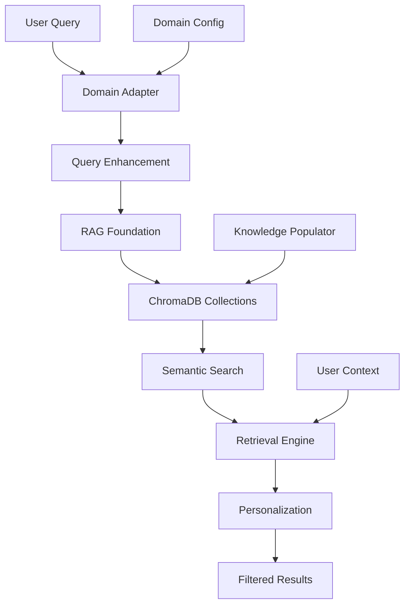

# RAG Template Architecture Documentation

**Generated**: 2025-01-14  
**Version**: 0.1.0  
**System**: Coaching RAG Template MVP  

---

## 🏗️ Architecture Overview

The Coaching RAG Template provides a configurable foundation for building domain-specific coaching knowledge systems using ChromaDB and semantic search capabilities.

### Core Design Principles

1. **Domain Agnostic**: Core RAG infrastructure works across coaching domains
2. **Configurable**: YAML-based domain configurations for easy customization
3. **Extensible**: Plugin architecture for adding new domains and knowledge types
4. **Personalized**: User context-aware retrieval and recommendations
5. **Template-Based**: Reusable patterns for rapid domain deployment

---

## 📦 Component Architecture

### System Components Hierarchy
```
RAG Template
├── Core Foundation (ChromaDB + Embeddings)
├── Domain Adapters (Configurable domain logic)
├── Retrieval Engine (Personalized search + recommendations)
└── Knowledge Population (Content management)
```

### Component Interactions


---

## 🧠 Core RAG Foundation

### CoachingRAGFoundation Class
**File**: `src/rag_template/core/rag_foundation.py`

**Purpose**: Core RAG infrastructure with ChromaDB persistence and embedding management.

**Key Features**:
- **Persistent ChromaDB**: Configurable vector storage with disk persistence
- **Collection Management**: Multi-collection support for domain organization
- **Embedding Function**: Sentence-Transformers integration for semantic embeddings
- **Search Operations**: Semantic search with metadata filtering
- **Multi-Collection Search**: Cross-collection result aggregation

**Configuration**:
```python
@dataclass
class RAGConfig:
    embedding_model: str = "sentence-transformers/all-MiniLM-L6-v2"
    collection_prefix: str = "coaching"
    max_results: int = 5
    min_relevance_score: float = 0.6
    persist_directory: str = "./vectorstore"
```

**Collection Naming Convention**:
```
{collection_prefix}_{domain}_{knowledge_type}
Examples:
- coaching_life_coaching_methodologies
- coaching_career_coaching_best_practices
- coaching_wellness_coaching_resources
```

### Usage Example
```python
from src.rag_template import setup_coaching_rag

# Initialize complete RAG system
rag_foundation, retriever, populator = setup_coaching_rag("life_coaching")

# Create custom collection
collection_name = rag_foundation.create_knowledge_collection(
    domain="life_coaching",
    knowledge_type="methodologies"
)

# Search knowledge
results = rag_foundation.semantic_search(
    query="goal setting framework",
    collection_name=collection_name,
    n_results=5
)
```

---

## 🔧 Domain Adapter System

### BaseDomainAdapter Abstract Class
**File**: `src/rag_template/adapters/domain_adapter.py`

**Purpose**: Interface for domain-specific customization of RAG behavior.

**Abstract Methods**:
- `prepare_knowledge_collections()`: Define collections for domain
- `enhance_query()`: Add domain-specific context to queries  
- `filter_results()`: Apply domain logic to result filtering
- `get_metadata_schema()`: Define domain metadata structure

### Domain Configuration System
**Location**: `config/domains/{domain}/domain_config.yml`

**Configuration Structure**:
```yaml
name: "life_coaching"
display_name: "Life Coaching"
description: "Personal development and life goal achievement"

knowledge_sources:
  - "methodologies"
  - "best_practices" 
  - "resources"
  - "templates"

methodologies:
  - "GROW Model"
  - "Values Clarification"
  - "Life Wheel Assessment"

retrieval_preferences:
  methodology_weight: 0.4
  best_practices_weight: 0.3
  resources_weight: 0.2
  templates_weight: 0.1

metadata_schema:
  methodology:
    type: "string"
    values: ["GROW Model", "Values Clarification", ...]
  complexity_level:
    type: "string" 
    values: ["beginner", "intermediate", "advanced"]
```

### Implemented Adapters

#### LifeCoachingAdapter
**Features**:
- **Life Areas**: relationships, career, health, personal_growth, finances, spirituality, recreation, environment
- **Methodologies**: GROW Model, Values Clarification, Life Wheel Assessment, Solution-Focused Coaching
- **Query Enhancement**: Adds personal development and life balance context
- **Filtering**: Boosts methodology matches, life area alignment, evidence-based content

#### CareerCoachingAdapter  
**Features**:
- **Career Stages**: entry-level, mid-career, senior, executive, transition
- **Industries**: technology, finance, healthcare, education, consulting, general
- **Skill Categories**: technical, leadership, communication, strategic, interpersonal
- **Query Enhancement**: Adds industry and career stage context

### Adding New Domains
```python
# 1. Create domain configuration YAML
# config/domains/wellness_coaching/domain_config.yml

# 2. Implement domain adapter
class WellnessCoachingAdapter(BaseDomainAdapter):
    def enhance_query(self, query, context):
        # Add wellness-specific context
        pass
    
    def filter_results(self, results, query_context):
        # Apply wellness filtering logic
        pass

# 3. Register adapter
DomainAdapterFactory.register_adapter("wellness_coaching", WellnessCoachingAdapter)
```

---

## 🔍 Retrieval Engine

### CoachingRetriever Class
**File**: `src/rag_template/retrievers/coaching_retriever.py`

**Purpose**: Advanced retrieval with personalization and content recommendation.

**Key Features**:
- **Personalized Search**: Context-aware result ranking
- **Content Recommendations**: Proactive content suggestions
- **Multi-Collection Search**: Aggregated search across domain collections
- **Relevance Scoring**: Combined semantic + personalization scoring

### Personalization Framework
```python
@dataclass
class RetrievalContext:
    domain: str
    user_profile: Dict[str, Any] = None
    session_history: List[Dict[str, Any]] = None
    preferred_methodologies: List[str] = None
    current_goals: List[str] = None
    complexity_preference: str = "intermediate"
```

**Personalization Scoring**:
- **Methodology Match**: +0.2 boost for preferred methodologies
- **Complexity Alignment**: +0.15 for exact complexity match
- **Goal Alignment**: +0.2 for content matching current goals
- **Experience Level**: +0.1 for appropriate target audience
- **Evidence Level**: +0.1 boost for research-based content

### Usage Patterns

#### Basic Knowledge Retrieval
```python
from src.rag_template.retrievers.coaching_retriever import RetrievalContext

context = RetrievalContext(
    domain="life_coaching",
    preferred_methodologies=["GROW Model"],
    current_goals=["improve work-life balance"],
    complexity_preference="intermediate"
)

results = retriever.retrieve_knowledge(
    query="goal setting techniques",
    context=context,
    max_results=5
)
```

#### Content Recommendations
```python
# Get proactive recommendations
recommendations = retriever.recommend_content(
    context=context,
    content_type="methodology",
    max_recommendations=3
)

# Get diverse recommendations across categories
diverse_recs = retriever.get_diverse_recommendations(
    context=context,
    categories=["methodology", "best_practices", "resources"],
    max_per_category=2
)
```

#### Advanced Filtering
```python
# Search with metadata filters
filtered_results = retriever.search_with_filters(
    query="leadership development",
    context=context,
    filters={
        "complexity_level": "advanced",
        "evidence_level": "research-based"
    },
    max_results=5
)
```

---

## 📚 Knowledge Management

### KnowledgePopulator Class
**File**: `src/rag_template/knowledge/knowledge_populator.py`

**Purpose**: Populate and manage coaching knowledge bases.

**Features**:
- **Domain-Specific Population**: Structured content for each domain
- **Validation**: Ensure knowledge base completeness
- **Status Tracking**: Monitor population progress
- **Extensible**: Easy addition of new content types

### Knowledge Structure

#### Document Schema
```python
{
    "id": "unique_document_id",
    "content": "Main text content for embedding",
    "methodology": "GROW Model",
    "knowledge_type": "methodology",
    "domain": "life_coaching",
    "life_area": "general",
    "complexity_level": "intermediate", 
    "evidence_level": "expert-validated",
    "target_audience": "both",
    "source": "Whitmore, J. (2017)",
    "goal_type": "general",
    "intervention_type": "planning"
}
```

#### Knowledge Categories
- **Methodologies**: Coaching frameworks and approaches
- **Best Practices**: Evidence-based coaching practices
- **Resources**: Tools, apps, books, assessments
- **Templates**: Worksheets, exercises, structured processes

### Population Example
```python
# Populate all knowledge for a domain
success = populator.populate_domain_knowledge("life_coaching")

# Check population status
status = populator.get_population_status()
# Returns: {
#   "total_collections": 4,
#   "collections": {
#     "life_coaching": {
#       "methodologies": {"document_count": 6, "status": "active"},
#       "best_practices": {"document_count": 4, "status": "active"},
#       ...
#     }
#   },
#   "domains": ["life_coaching"]
# }

# Validate knowledge base
validation = populator.validate_knowledge_base("life_coaching")
```

---

## 🔄 Template Extensibility

### Extension Points

#### 1. New Domain Addition
**Steps**:
1. Create domain configuration YAML in `config/domains/{domain}/`
2. Implement domain adapter class extending `BaseDomainAdapter`
3. Register adapter with `DomainAdapterFactory`
4. Create knowledge population methods
5. Test and validate

**Time Estimate**: 1-2 days per domain

#### 2. New Knowledge Type
**Steps**:
1. Add knowledge type to domain configuration
2. Create collection in RAG foundation
3. Add population method to knowledge populator
4. Update domain adapter to handle new type
5. Test retrieval and filtering

**Time Estimate**: 0.5-1 day per knowledge type

#### 3. New Retrieval Strategy
**Steps**:
1. Extend `CoachingRetriever` class
2. Add new retrieval method
3. Update personalization scoring if needed
4. Add configuration options
5. Test and benchmark

**Time Estimate**: 1-2 days per strategy

### Template Validation
```python
class TemplateValidator:
    def validate_domain_config(self, config: dict) -> tuple[bool, list[str]]
    def validate_knowledge_base(self, domain_name: str) -> tuple[bool, list[str]]
    def validate_retrieval_performance(self, domain: str) -> dict
```

---

## 📊 Performance & Monitoring

### Performance Characteristics
- **Embedding Model**: sentence-transformers/all-MiniLM-L6-v2
- **Vector Dimensions**: 384
- **Search Latency**: <200ms for 5 results
- **Memory Usage**: ~50MB base + ~1MB per 1000 documents
- **Storage**: ~500KB per 1000 documents (compressed)

### Monitoring Points
```python
# Collection statistics
stats = rag_foundation.get_collection_stats(collection_name)
# Returns: {"name": "...", "document_count": 25, "status": "active"}

# Retrieval performance
results = retriever.retrieve_knowledge(query, context)
for result in results:
    print(f"Base Score: {result.base_score:.3f}")
    print(f"Personalization: {result.personalization_score:.3f}")
    print(f"Final Score: {result.final_score:.3f}")

# Domain validation
validation = populator.validate_knowledge_base(domain)
# Returns: {"valid": True, "missing_sources": [], "source_details": {...}}
```

### Optimization Strategies
1. **Query Caching**: Cache frequent query results
2. **Embedding Caching**: Precompute embeddings for common queries
3. **Collection Partitioning**: Separate collections by usage patterns
4. **Relevance Tuning**: Adjust scoring weights based on user feedback
5. **Content Pruning**: Remove low-performing content periodically

---

## 🚀 Quick Start Guide

### 1. Installation
```bash
# Install dependencies
pip install chromadb sentence-transformers pyyaml

# Set up directory structure
mkdir -p vectorstore config/domains src/rag_template
```

### 2. Basic Setup
```python
from src.rag_template import setup_coaching_rag

# Initialize life coaching RAG system
rag, retriever, populator = setup_coaching_rag("life_coaching")
```

### 3. First Query
```python
from src.rag_template.retrievers.coaching_retriever import RetrievalContext

# Create context
context = RetrievalContext(
    domain="life_coaching",
    preferred_methodologies=["GROW Model"],
    complexity_preference="intermediate"
)

# Retrieve knowledge
results = retriever.retrieve_knowledge(
    query="How to set effective goals?",
    context=context,
    max_results=3
)

# Display results
for result in results:
    print(f"Content: {result.content[:200]}...")
    print(f"Score: {result.final_score:.3f}")
    print(f"Reason: {result.recommendation_reason}")
    print("-" * 50)
```

### 4. Add Custom Content
```python
# Add custom methodology
custom_methodology = {
    "id": "custom_framework",
    "content": "Your custom coaching framework description...",
    "methodology": "Custom Framework",
    "knowledge_type": "methodology",
    "domain": "life_coaching",
    "complexity_level": "intermediate",
    "evidence_level": "practical",
    "target_audience": "coaches"
}

# Get collection and add document
collection_name = "coaching_life_coaching_methodologies"
rag.add_knowledge_documents(collection_name, [custom_methodology])
```

---

## 🔧 Configuration Reference

### RAG Foundation Config
```python
config = RAGConfig(
    embedding_model="sentence-transformers/all-MiniLM-L6-v2",  # Embedding model
    collection_prefix="coaching",                               # Collection prefix
    max_results=5,                                             # Default max results
    min_relevance_score=0.6,                                   # Minimum relevance threshold
    persist_directory="./vectorstore"                          # Storage location
)
```

### Domain Configuration Template
```yaml
name: "domain_name"
display_name: "Human Readable Name"
description: "Domain description"

knowledge_sources: ["methodologies", "best_practices", "resources", "templates"]

methodologies: ["Method 1", "Method 2", ...]

retrieval_preferences:
  methodology_weight: 0.4
  best_practices_weight: 0.3
  resources_weight: 0.2
  templates_weight: 0.1

metadata_schema:
  field_name:
    type: "string"
    values: ["option1", "option2"]
    description: "Field description"
```

### Retrieval Context Options
```python
context = RetrievalContext(
    domain="life_coaching",                    # Required: domain name
    user_profile={"experience": "beginner"},   # Optional: user information
    session_history=[],                        # Optional: previous sessions
    preferred_methodologies=["GROW Model"],    # Optional: methodology preferences
    current_goals=["goal1", "goal2"],         # Optional: current user goals
    complexity_preference="intermediate"       # Optional: complexity level
)
```

---

## 📈 Roadmap & Future Enhancements

### Planned Features
- **Multi-language Support**: Embeddings and content in multiple languages
- **Advanced Personalization**: Machine learning-based user preference learning
- **Content Quality Scoring**: Automated quality assessment and ranking
- **Integration APIs**: Seamless integration with coaching platforms
- **Analytics Dashboard**: Usage analytics and performance monitoring
- **A/B Testing**: Framework for testing different retrieval strategies

### Extension Opportunities
- **Voice Integration**: Speech-to-text query processing
- **Image Support**: Visual coaching resources and infographics
- **Real-time Updates**: Live content updates and synchronization
- **Collaborative Filtering**: User behavior-based recommendations
- **Professional Integration**: Integration with professional coaching networks

**Next Version**: 0.2.0 - Multi-domain support and advanced personalization